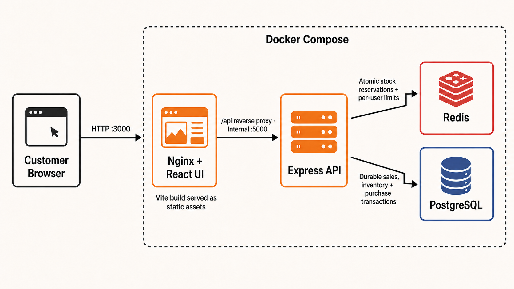

# Flash Sale Monorepo

This repository contains a Flash Sale API and frontend organized as npm workspaces. Docker Compose provides a complete local environment for building and running the application and its supporting services from one place.

```text
apps/
├── api/  Express API backed by PostgreSQL and Redis
└── ui/   React/Vite frontend, served by Nginx in Docker
```

## Design choices and trade-offs

- **npm workspaces** keep the independently runnable API and UI in one repository without coupling their dependency trees or application code. Each application retains its own `package.json` and lockfile. The trade-off is that dependencies are not deliberately shared or deduplicated between Docker images.
- **Horizontally replicated API** runs three API containers by default. Nginx dynamically resolves the Compose service and balances requests across healthy addresses. The replica count is configurable with `API_REPLICAS`.
- **Multi-stage UI image** builds the Vite application with Node and serves only the generated static files from Nginx. This produces a smaller runtime image, at the cost of requiring a rebuild when build-time frontend environment variables change.
- **Same-origin API proxy** sends browser requests from Nginx `/api` to the internal API service. This avoids browser CORS configuration and keeps internal container names out of frontend code.
- **PostgreSQL is authoritative; Redis coordinates claims.** Redis performs fast atomic stock/user reservations, while PostgreSQL transactions and row locks provide the durable final check. This favors correctness under contention, with additional operational complexity from maintaining two data stores.
- **Named volumes** preserve PostgreSQL and Redis data across container restarts. The schema initialization script runs only when PostgreSQL creates an empty volume; schema changes need an explicit migration strategy in a production system.
- **Private API network** exposes the application through Nginx only. PostgreSQL and Redis are published in the local stack for developer tooling; the production topology uses private external HA endpoints.

## System diagram



The browser has one public entry point: Nginx serves the compiled React application and forwards same-origin `/api` requests to Express. This keeps deployment and browser networking simple and avoids exposing internal service names to the client. Express uses Redis for fast atomic reservation decisions, while PostgreSQL remains the durable source of truth for sales, inventory, and purchases. Docker Compose packages these responsibilities into independently replaceable services and starts them in dependency order using health checks.

## Prerequisites

- Docker Desktop with Docker Compose, for the complete containerized stack
- Node.js 20 or newer and npm, for local application development

Optionally copy the root environment template to override ports or credentials:

```bash
cp .env.example .env
```

Change `ADMIN_PASSWORD` and `ADMIN_JWT_SECRET` before using the application anywhere other than a disposable local environment.

## Build and run with Docker

Build and start the server, frontend, and supporting services:

```bash
docker compose up --build
```

Wait until `api` is healthy, then open:

- Storefront: <http://localhost:3000>
- Admin portal: <http://localhost:3000/admin>
- API health endpoint through Nginx: <http://localhost:3000/api/health>
- Redis Insight: <http://localhost:5540>

Run in the background and inspect the services with:

```bash
docker compose up --build -d
docker compose ps
docker compose logs -f api ui
```

Stop the stack while retaining data:

```bash
docker compose down
```

Delete the disposable PostgreSQL and Redis data as well:

```bash
docker compose down --volumes
```

The default host ports are UI `3000`, API `5000`, PostgreSQL `5432`, and Redis `6379`. Nginx load balances both UI `/api` requests and host port `5000` requests across the private API replicas. Override published ports or `API_REPLICAS` in the root `.env`.

> **macOS port 5000:** AirPlay Receiver may reserve port `5000` and return HTTP `403` for API requests. Disable **AirPlay Receiver** under **System Settings → General → AirDrop & Handoff**, then restart the stack. Alternatively, set `API_PORT=5001` in the root `.env`. For non-Docker Vite development, keep `VITE_API_URL` empty and set `API_PROXY_TARGET=http://localhost:5001` in `apps/ui/.env`.

## Production topology

The local stack intentionally provides single-node PostgreSQL and Redis for development. The production overlay expects provider-managed PostgreSQL and Redis endpoints with replication, automatic primary failover, backups, and TLS, rather than pretending that containers on one host provide high availability.

Prepare production configuration:

```bash
cp .env.production.example .env.production
```

Set `DATABASE_URL` to the PostgreSQL writer/failover endpoint and `REDIS_URL` to the Redis primary or cluster endpoint. Then start the stateless application tier:

```bash
docker compose \
  --env-file .env.production \
  -f compose.production.yaml \
  up --build -d
```

This topology includes:

- configurable API replicas behind Nginx dynamic DNS load balancing;
- start-first rolling API updates and bounded container restart policies;
- configurable CPU and memory limits;
- TLS-capable PostgreSQL and Redis URLs;
- configurable PostgreSQL pool size, connection timeout, idle timeout, and connection lifetime;
- Redis connection timeout and bounded exponential reconnect delay.

Keep the combined maximum pool capacity within the database provider limit: `API_REPLICAS × DATABASE_POOL_MAX`, plus operational connections. For example, three replicas with a pool maximum of 20 can open up to 60 application connections.

## Run locally for development

Run only PostgreSQL and Redis in Docker:

```bash
docker compose up -d db redis
```

Install both npm workspaces and prepare the API environment:

```bash
npm install
cp apps/api/.env.example apps/api/.env
```

Start the API in one terminal:

```bash
npm run dev:api
```

Start the frontend in another terminal:

```bash
npm run dev:ui
```

The Vite frontend runs at <http://localhost:3000> and proxies `/api` to the API at <http://localhost:5000>. Both development processes reload when source files change.

## Build and tests

Build the production frontend locally:

```bash
npm run build
```

Run the complete automated test suite from the repository root:

```bash
npm test
```

Run either layer independently:

```bash
npm run test:unit
npm run test:integration
```

The unit suite isolates the sale service and verifies identifier validation, upcoming-sale rejection, per-user limits, sold-out reservations, successful durable purchases, and reservation compensation when PostgreSQL fails. The integration suite sends HTTP requests through the Express application with Supertest and verifies sale listing, status lookup, claim creation, and structured API errors.

The tests do not require Docker because external persistence is mocked at the service boundary. The end-to-end stress test below exercises the real PostgreSQL and Redis integrations.

Optional smoke checks against a running stack are:

```bash
curl --fail --silent --show-error http://localhost:3000/api/health
curl --fail --silent --show-error http://localhost:3000/api/sale/flash
curl --fail --head http://localhost:3000/
curl --fail --head http://localhost:3000/admin
```

Expected results are HTTP `200` responses, health JSON containing `"status":"ok"`, `"database":1`, and `"redis":1`, plus a JSON `sales` array from the sale endpoint. A dependency that is down is reported as `0` with HTTP `503` and status `"degraded"`. Docker continuously executes this dependency-aware API health check; `docker compose ps` should report `db`, `redis`, and every `api` replica as healthy.

## Stress test

The stress runner creates its own active disposable sale, sends concurrent purchase attempts with unique user identifiers, collects latency and throughput metrics, and fails with a non-zero exit code if any inventory invariant is violated. It exercises Nginx, Redis, Express, and PostgreSQL together.

> **Warning:** This test creates purchases and consumes real inventory. Use a disposable local database and a dedicated active sale. Do not run it against production.

Start the complete stack:

```bash
docker compose up --build -d
```

Run the default scenario of 200 requests, 50 concurrent workers, and 100 available units:

```bash
npm run test:stress
```

Run the predefined larger scenarios:

```bash
# 10,000-request burst with 250 concurrent workers
npm run test:stress:spike

# Sustained traffic for 60 seconds with 100 concurrent workers
npm run test:stress:soak
```

Configuration is available through environment variables:

```bash
BASE_URL=http://localhost:3000 \
REQUESTS=1000 \
CONCURRENCY=100 \
STOCK=500 \
DURATION_SECONDS=0 \
ADMIN_USERNAME=admin \
ADMIN_PASSWORD=change_me \
npm run test:stress
```

`BASE_URL` should point to the UI/Nginx origin so the test covers the same request path used by customers. The admin credentials must match the API environment. Each run creates a uniquely named sale and prints its ID, response counts, elapsed time, throughput, p50/p95 latency, and final database inventory.

### Expected stress-test outcome

For the default scenario:

- exactly 100 requests must return HTTP `201` (`PURCHASE_SUCCESSFUL`);
- the remaining 100 should return HTTP `409` with `SOLD_OUT`;
- final `remainingStock` should be `0`, never negative;
- there should be no HTTP `500` responses, duplicate purchase IDs, or more successful purchases than starting inventory.

The test automatically asserts those conditions. Its main correctness invariant is `successful claims <= starting inventory`, with PostgreSQL inventory matching the durable purchases after the run. A `503 CLAIM_SERVICE_UNAVAILABLE` means Redis was unavailable and causes this stress scenario to fail.

### Measured local results

The scaled three-replica stack was tested on August 18, 2026:

| Metric | 10,000-request spike | 10-second soak validation |
| --- | ---: | ---: |
| Concurrency | 250 | 100 |
| Requests completed | 10,000 | 24,655 |
| Starting stock | 5,000 | 5,000 |
| Successful purchases | 5,000 | 5,000 |
| Sold-out responses | 5,000 | 19,655 |
| Server errors | 0 | 0 |
| Final stock | 0 | 0 |
| Throughput | 1,315.8 requests/second | 2,459.5 requests/second |
| p50 latency | 158.4 ms | 21.2 ms |
| p95 latency | 465.9 ms | 150.3 ms |

Both scenarios preserved the important correctness invariant: successful purchases exactly matched available stock, all excess requests were rejected, and inventory never became negative. The higher soak throughput occurs after inventory is exhausted because Redis rejects sold-out requests before they enter the PostgreSQL transaction path. Performance figures are machine-dependent; the response distribution, absence of server errors, and inventory invariants are the portable results.

Reset local data before repeating an identical test:

```bash
docker compose down --volumes
docker compose up --build
```
